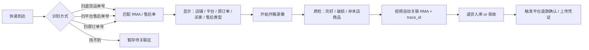

# 售后管理架构（RMA）

> **适用范围：电商平台订单**（抖店、淘宝、小红书、视频号、闲鱼等）。门店订货、维修服务单通常不走本模块，或有独立的线下处理流程。
>
> 核心场景：**收到退货快递 → 拍开箱视频 → 识别属于哪个店铺/哪张平台售后单 → 检验处理 → 视频与售后单关联 → 回传平台**

---

## 1. 售后在整体链路中的位置

```
正向（发货）                         逆向（售后）
────────────────────────────────────────────────────────────
平台下单 SO ──► 出库 DO ──► 打包视频 ──► 运单
     │                                      │
     │         trace_id 同一根               │
     │                                      ▼
     └──────► 平台售后单 RMA ◄── 买家申请（平台侧）
                    │
                    ▼
              买家寄回（退货运单）
                    │
                    ▼
              仓库签收 → 开箱视频 → 质检 → 退货入库
                    │
                    ▼
              同意/拒绝退款 → 回传平台（可附带视频证据）
```

售后不是孤立模块，它挂在 **原销售订单 trace_id** 上，并复用 **media_evidences（开箱视频）**、**WMS 退货入库**、**Integration 平台回传**。

---

## 2. 领域模型：AfterSale（RMA）

| 实体 | 说明 |
|------|------|
| **after_sale_orders** | 售后单主表（内部 RMA），一对一或一对多关联平台售后 |
| **after_sale_items** | 售后商品行（sku、数量、退款金额） |
| **return_shipments** | 买家寄回的快递（退货运单号） |
| **return_receipts** | 仓库签收登记（收到包裹） |
| **return_inspections** | 开箱质检结果 |
| **media_evidences** | 开箱视频/照片（复用供应链模块，`media_type=unbox_video`） |

### 2.1 售后单关键字段

```
after_sale_orders
  ├── rma_no                    -- 内部售后单号 RMA-xxx
  ├── trace_id                  -- 继承原销售订单 trace_id
  ├── order_id                  -- 关联内部 SO
  ├── platform_shop_id          -- ★ 哪个店铺（抖店 A / 淘宝 B）
  ├── source_channel            -- douyin / taobao / xhs / ...
  ├── platform_after_sale_id    -- 平台售后单 ID（唯一：shop + platform_id）
  ├── platform_order_id         -- 平台原始订单号
  ├── after_sale_type           -- 仅退款 / 退货退款 / 换货
  ├── reason_code / reason_text -- 售后原因
  ├── status                    -- 见状态机
  ├── refund_amount
  ├── buyer_return_tracking_no  -- 买家退货运单号
  ├── return_carrier_code
  └── platform_status           -- 平台侧状态镜像
```

**「知道是哪个店铺」**：来自原 SO 的 `platform_shop_id` + `source_channel`，售后单创建时快照，仓库人员无需猜。

---

## 3. 售后状态机

```
                    ┌─────────────────┐
                    │ 待买家退货        │  平台已同意退货，等买家寄回
                    └────────┬────────┘
                             │ 录入/同步退货运单号
                    ┌────────▼────────┐
                    │ 退货在途          │
                    └────────┬────────┘
                             │ 仓库签收
                    ┌────────▼────────┐
                    │ 待开箱检验        │  ← 开箱视频在此环节拍摄
                    └────────┬────────┘
                             │ 质检完成
              ┌──────────────┼──────────────┐
              ▼              ▼              ▼
        ┌──────────┐  ┌──────────┐  ┌──────────┐
        │ 待平台确认 │  │ 已拒绝    │  │ 换货待发  │
        │ (同意退款) │  │ (货不对板等)│  │          │
        └─────┬────┘  └──────────┘  └──────────┘
              │ 回传平台成功
        ┌─────▼────┐
        │ 已完成     │
        └──────────┘

仅退款（未发货/已发货平台判责）：可跳过退货入库，但仍可能需要内部备注
```

---

## 4. 核心场景：收货 → 开箱视频 → 关联售后

### 4.1 仓库收货台流程（推荐）



### 4.2 包裹识别（解决「不知道是哪单」）

按优先级匹配：

| 优先级 | 识别方式 | 说明 |
|--------|----------|------|
| 1 | **退货运单号** | 买家填写的寄回单号，或 Integration 从平台同步 |
| 2 | **平台售后单号** | 包裹内售后卡 / 面单备注 |
| 3 | **原平台订单号** | 订单号条码 |
| 4 | **买家手机后四位 + 日期** | 辅助搜索 |
| 5 | **人工暂存** | 录入 `return_receipts` 状态=待关联，24h 内补关联 |

### 4.2.1 退货运单号解析：本地索引 + 平台 API（推荐）

各电商接入 **售后 API / 订单 API** 后，退货运单号应成为收货台的 **第一匹配键**。解析采用 **本地优先、API 兜底、多店并行** 三层策略：

```
扫描退货运单号 SF1234567890
        │
        ▼
┌───────────────────┐
│ ① 本地索引（毫秒级）│  after_sale_orders.buyer_return_tracking_no
└─────────┬─────────┘  唯一索引，数据来自 Webhook / 定时拉单
          │ 命中 → 直接展示 RMA + 店铺 + 原订单 + 应退 SKU
          │ 未命中 ↓
┌───────────────────┐
│ ② 平台 API 反查    │  按已授权店铺并行查询（见下表）
└─────────┬─────────┘  命中 → 写入本地 RMA/更新运单号 → 展示
          │ 仍未命中 ↓
┌───────────────────┐
│ ③ 暂存待关联       │  记录运单号 + 签收时间，后续补绑或重试拉单
└───────────────────┘
```

**为什么需要本地索引：** 平台 API 有频率限制、延迟，仓库扫码不能等 2～3 秒。正常情况买家填写退货运单后，Webhook 或 5～15 分钟轮询已把单号写入本地，扫码即命中。

**为什么还需要 API 兜底：** 买家刚填单号就寄出、Webhook 未到、或历史数据缺失时，收货台可 **实时调平台 API** 按退货运单号反查售后单，查回后落库，下次同单号走本地。

#### 平台 API 典型能力（接入时逐平台确认）

| 平台 | 常见能力 | 退货运单号用法 |
|------|----------|----------------|
| **抖店** | 售后列表、售后详情、买家退货物流 | 详情含 `return_logistics_code`，可列表过滤或详情匹配 |
| **淘宝/天猫** | 退款/退货 API、物流同步 | 退货运单在 refund 详情中，需按店铺授权查询 |
| **小红书** | 售后单 API | 类似抖店，售后单含退回物流 |
| **视频号小店** | 微信售后接口 | 售后单 + 退货物流字段 |
| **闲鱼** | 能力较弱 | 可能以本地录入 + 半人工为主，API 能补则补 |

各平台字段名不同，由 **Integration Adapter** 统一输出：

```go
type ReturnLogisticsLookup struct {
    ReturnTrackingNo     string
    PlatformShopID       string
    SourceChannel        string
    PlatformAfterSaleID  string
    PlatformOrderID      string
    AfterSaleType        string
    Items                []AfterSaleItem
    BuyerName            string
}
```

#### 多店铺：扫一次单号，查所有店

一个主体下常有多个抖店/淘宝店，反查逻辑：

1. **本地**：`SELECT * FROM after_sale_orders WHERE buyer_return_tracking_no = ?`（不区分店铺，单号全局唯一即可）
2. **API 兜底**：对 `platform_shop` 表中 `status=authorized` 的店铺 **并行** 调用 `LookupAfterSaleByReturnTracking(ctx, shopID, trackingNo)`，谁先返回用谁；若多店命中同一单号（极少），界面列出候选让人工确认
3. **运单订阅（可选增强）**：对接快递100 等，包裹揽收时按单号匹配本地 RMA，收货台扫码前就已「预关联」

#### 数据同步：让本地索引尽量完整

| 方式 | 说明 |
|------|------|
| **Webhook** | 买家填写退货运单、售后状态变更 → 实时更新 `buyer_return_tracking_no` |
| **定时拉单** | 每 5～15 分钟拉「待退货/退货在途」售后单，补全运单号 |
| **收货台 API 反查** | 仅本地未命中时触发，避免滥用平台配额 |

建议在 `after_sale_orders.buyer_return_tracking_no` 上建 **唯一索引**（允许多个 NULL），并在 Integration Worker 中把平台原始报文存 `raw_payload` 便于对账。

#### 收货台命中后的展示（本地 / API 统一体验）

无论数据来自本地索引还是平台 API 反查，扫码后统一展示：

- **店铺名称**（如「抖店 · XX 旗舰店」）+ 平台图标
- **平台售后单号** + **原平台订单号**
- 售后类型、应退 SKU/数量、买家信息
- 原订单 **打包视频** 链接（与开箱视频对照判责）
- **开始开箱录像** → 自动绑定当前 RMA

### 4.3 开箱视频关联规则

复用 `media_evidences` 表，扩展 `media_type`：

| media_type | 场景 |
|------------|------|
| `pack_video` | 正向打包发货 |
| `unbox_video` | **售后开箱** |
| `unbox_photo` | 开箱关键帧/照片 |
| `damage_photo` | 货损证据 |

```
media_evidences
  ├── ref_doc_type = after_sale_order | return_receipt
  ├── ref_doc_id
  ├── trace_id              -- 与原 SO 相同
  ├── platform_shop_id      -- 冗余，便于按店铺检索
  ├── file_url
  └── uploaded_at / uploaded_by
```

**一条 RMA 可有多段视频**（多包裹退回），但每段必须挂 `return_receipt_id`。

### 4.4 给「哪个电商售后」关联 — 两层关系

```
内部 RMA（after_sale_orders）
    ├── platform_after_sale_id  →  平台售后工单的 ID
    └── order_id                →  内部 SO → platform_order_id

开箱视频（media_evidences）
    └── ref_doc_id = RMA.id
```

处理人员在 **售后详情页** 看到：
- 左侧：平台售后信息 + 店铺
- 右侧：开箱视频列表 + 「同步凭证到平台」按钮
- 底部：原订单追溯链（打包视频、出库批次、供应商）

---

## 5. 与 WMS / 库存的衔接

### 5.1 退货入库

```
return_receipts（签收）
    → return_inspections（质检：良品/次品/非本店）
        → inbound_orders（type=return_in, ref=rma_id）
            → 良品 → 可售批次（新 lot 或回原 lot，策略可配置）
            → 次品 → 残次品仓 / 报损
            → 非本店 → 不入库，标记拒收
```

`stock_movements.type = return_in`，关联 `trace_id` 与原 outbound 可追溯。

### 5.2 换货

- 售后类型 = 换货：质检通过后生成 **新 SO 或换货 outbound**，沿用原 trace_id 或子 trace
- 旧货走 return_in，新货走 sale_out

---

## 6. 平台 Integration（售后专用）

每个平台 Adapter 扩展：

```go
type AfterSaleAdapter interface {
    // 拉取售后列表（增量）
    PullAfterSales(ctx, shopID string, since time.Time) ([]PlatformAfterSale, error)
    HandleAfterSaleWebhook(ctx, body []byte) (*PlatformAfterSale, error)

    // 仓库收货后回传
    ConfirmReturnReceived(ctx, platformAfterSaleID string, req ReturnConfirm) error
    AgreeRefund(ctx, platformAfterSaleID string, req RefundAgree) error
    RejectRefund(ctx, platformAfterSaleID string, req RefundReject) error

    // 上传凭证（若平台支持）
    UploadEvidence(ctx, platformAfterSaleID string, mediaURL string, mediaType string) error
}
```

| 平台 | 典型差异 |
|------|----------|
| 抖店 | 售后单 API、退货物流同步、凭证上传 |
| 淘宝 | 退款/退货/refund 接口体系不同，需单独适配 |
| 小红书 | 售后状态枚举与抖店类似 |
| 视频号 | 微信生态，凭证多为图片/视频 URL |
| 闲鱼 | 可能半人工，系统记录 + 人工在 App 操作 |

**shop_id 决定调哪个 Adapter + 哪个授权 token**，避免退错店铺。

---

## 7. 追溯链扩展（逆向）

原 trace_id 上追加节点：

```
trace_id: TR202606150001
  ├── SO-xxx                 原销售订单（douyin, 店铺A）
  ├── DO-xxx / MEDIA-pack    正向打包
  ├── RMA-xxx                售后单（退货退款）
  ├── RETURN-RCV-xxx         退货签收
  ├── MEDIA-unbox-xxx        ★ 开箱视频
  ├── IN-RETURN-xxx          退货入库
  └── PLATFORM-REFUND-OK     平台退款完成
```

TraceHub 时间线可对比 **打包视频 vs 开箱视频**，辅助判责。

---

## 8. 管理后台功能规划

### 8.1 菜单

```
售后管理（仅电商）
├── 售后单列表        按店铺/平台/状态筛选
├── 待签收退货        在途退货运单
├── 退货签收台        ★ 扫码收货 + 开箱录像（核心工作台）
├── 待质检 / 待退款
└── 售后凭证库        按店铺/日期浏览开箱视频
```

### 8.2 「退货签收台」UI 要点

- 大输入框：扫退货运单 / 售后单号
- 识别成功后大字显示：**店铺名 + 平台 + 售后类型**
- 「开始录像 / 停止并上传」
- 质检表单：SKU 核对、数量、外观、是否原包装
- 一键「同意退款并回传平台」/ 「拒绝并填写原因」

### 8.3 权限

- 仓库员：签收、录像、质检
- 售后客服：审核、平台回传、查看视频
- 按 **platform_shop_id** 做数据权限（多店铺运营）

---

## 9. 分阶段建设

| 阶段 | 内容 |
|------|------|
| **P4+** | OMS 订单稳定后，售后单表结构 + 手工创建 RMA |
| **P5** | 退货签收台 + 开箱视频关联 trace_id / RMA |
| **P6** | 第一个平台售后 API 对接（建议抖店）+ 退货运单同步 |
| **P7** | 退货入库 WMS + 库存回滚 |
| **P8** | 多平台售后 + 凭证上传 + 按店铺报表 |

**依赖关系：**
- 必须先有 **OMS 订单 + platform_shop_id**，售后才能知道店铺
- 开箱视频复用 **media_evidences + OSS**，与打包视频同一套
- **trace_id** 在原 SO 创建时已有，RMA 继承即可

---

## 10. 核心表清单

```
after_sale_orders          -- 售后主表
after_sale_items           -- 售后行
return_shipments           -- 买家退货运单（可与 RMA 合并，看设计）
return_receipts            -- 仓库签收
return_inspections         -- 质检
media_evidences            -- 开箱视频（共享）
inbound_orders             -- type=return_in（共享 WMS）
document_links             -- RMA ↔ SO ↔ MEDIA ↔ INBOUND
trace_events               -- 售后各环节事件
```

---

## 11. 设计原则

1. **售后只服务电商订单** — `source_channel` 非 store/service 才进 RMA；门店另议
2. **店铺信息从原 SO 快照** — 收货台第一眼就知道退给哪个店
3. **开箱视频必须绑 RMA** — 不能只有孤立文件，否则无法给平台售后关联
4. **退货运单号是收货第一匹配键** — Integration 尽量从平台同步买家填写的单号
5. **逆向也走 trace_id** — 正向打包视频与逆向开箱视频同链可查
6. **平台凭证能传则传** — 不能 API 上传的，后台提供视频链接供客服手动提交

---

## 12. 一句话总结

> **平台售后单（哪个店）← 原订单 ← trace_id；退货签收扫单号 → 拍开箱视频 → 视频挂 RMA → 质检入库 → 回传平台同意退款。**

与 [SUPPLY_CHAIN.md](./SUPPLY_CHAIN.md) 的关系：打包视频管「发出去」，开箱视频管「退回来」，同属 `media_evidences`，共用追溯链。
