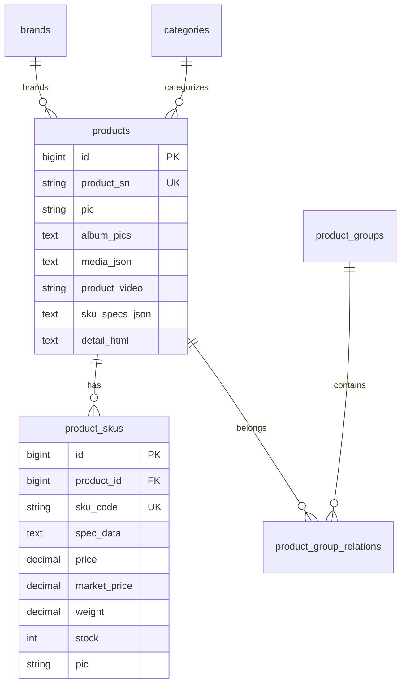

# 商品编辑页反向设计（Frontend → Backend）

> 依据管理后台「编辑商品」抽屉（`ProductEdit.vue`）的 UI 能力，反推数据库、DTO 与 API 的优化方案。

## 1. 页面功能分区

| 分区 | 前端区块 | 业务含义 |
|------|----------|----------|
| 商品资料 | 基础信息 | SPU 身份、标题、分类归属、上下架 |
| 商品资料 | 图文信息 | 多比例主图、视频、素材图、详情图/富文本 |
| 销售信息 | 商品规格 | 规格维度 + 规格值元数据（备注/图片） |
| 销售信息 | 规格信息 | SKU 矩阵：价格、库存、编码、重量 |

## 2. 前后端字段对照（现状 vs 目标）

### 2.1 基础信息 — 已对齐

| UI 字段 | 前端 | 后端 `products` | 状态 |
|---------|------|-----------------|------|
| 资料编码 | `productSn` | `product_sn` | ✅ |
| 商品标题 | `name` | `name` | ✅ |
| 导购短标题 | `subTitle` | `sub_title` | ✅ |
| 商品描述 | `description` | `description` | ✅ |
| 品牌/分类/分组 | `brandId` / `categoryId` / `groupIds` | 外键 + `product_group_relations` | ✅ |
| 单位/排序/上架 | `unit` / `sort` / `publishStatus` | 同名字段 | ✅ |

### 2.2 图文信息 — 需扩展

| UI 字段 | 前端 ref | 原后端 | 目标存储 |
|---------|----------|--------|----------|
| 商品主图（1:1，≤10） | `pic` + `albumPics` | `pic` + `album_pics` JSON | ✅ 保持 |
| 3:4 主图（≤5） | `pics34` | ❌ 未存 | `media_json.pics34[]` |
| 商品视频 | `video11/34/169/916` | 仅 `product_video` | `media_json.videos.*` |
| 素材图（4 类） | `material*` | ❌ 未存 | `media_json.materials.*` |
| 详情图（≤50） | `detailPics` | 混入 `detail_html` | `media_json.detailPics[]` + `detail_html` |
| 富文本详情 | `detailHtml` | `detail_html` | ✅ 保持 |

**设计决策**：SPU 级扩展媒体统一放入 `products.media_json`（TEXT/JSONB），避免列爆炸；主图仍用 `pic`+`album_pics` 便于列表查询。

```json
{
  "pics34": ["url1", "url2"],
  "videos": {
    "ratio11": "url",
    "ratio34": "url",
    "ratio169": "url",
    "ratio916": "url"
  },
  "materials": {
    "white": "url",
    "transparent": "url",
    "guide34": "url",
    "long": "url"
  },
  "detailPics": ["url1", "url2"]
}
```

`product_video` 保留为 **主视频**（兼容 Open API），写入时同步 `videos.ratio11`。

### 2.3 商品规格 — 需结构化

| UI 能力 | 原 `sku_specs_json` | 目标结构 |
|---------|---------------------|----------|
| 规格名 | `{ name }` | 不变 |
| 规格值文本 | `values: ["红","L"]` | `values: [{ value, remark?, pic? }]` |
| 规格备注 | 前端内存 | `remark` |
| 第一组规格图 | 前端内存 → SKU.pic | `pic` + 同步至 SKU |

```json
[
  {
    "name": "颜色",
    "values": [
      { "value": "红色", "remark": "热卖色", "pic": "https://..." },
      { "value": "蓝色" }
    ]
  },
  { "name": "尺码", "values": [{ "value": "L" }, { "value": "XL" }] }
]
```

**兼容**：读取时 `values` 可为 `string[]` 或对象数组，服务层归一化。

### 2.4 规格信息（SKU 表）— 需扩展

| UI 列 | 前端 `SkuItem` | 原 `product_skus` | 目标 |
|-------|----------------|-------------------|------|
| 规格组合 | `specs` | `spec_data` JSON | ✅ |
| 预览图 | `pic` | `pic` | ✅ |
| 市场价 | `marketPrice` | ❌ | `market_price` |
| 销售价 | `price` | `price` | ✅ |
| 库存 | `stock` | `stock` | ✅ |
| 规格编码 | `skuCode` | `sku_code` | ✅ |
| 重量(g) | `weight` | ❌ | `weight` |
| 成本价 | —（UI 未展示） | `cost_price` | 保留供供应链 |

**SPU 汇总规则**（与前端 `handleSave` 一致）：

- `products.price` = SKU 最低销售价
- `products.original_price` = SKU 最高市场价
- `products.stock` = SKU 库存之和

## 3. 数据库 DDL（增量）

```sql
-- products
ALTER TABLE products ADD COLUMN IF NOT EXISTS media_json TEXT DEFAULT '';

-- product_skus
ALTER TABLE product_skus ADD COLUMN IF NOT EXISTS market_price DECIMAL(10,2) DEFAULT 0;
ALTER TABLE product_skus ADD COLUMN IF NOT EXISTS weight DECIMAL(10,2) DEFAULT 0;
```

GORM AutoMigrate 会自动加列（SQLite/PostgreSQL）。

## 4. API 契约（ProductDTO 扩展）

```typescript
interface ProductMedia {
  pics34?: string[]
  videos?: { ratio11?: string; ratio34?: string; ratio169?: string; ratio916?: string }
  materials?: { white?: string; transparent?: string; guide34?: string; long?: string }
  detailPics?: string[]
}

interface SkuSpecValue {
  value: string
  remark?: string
  pic?: string
}

interface SkuSpec {
  name: string
  values: SkuSpecValue[]
}

interface SkuItem {
  skuCode: string
  specs: Record<string, string>
  price: number
  marketPrice?: number
  stock: number
  weight?: number
  pic?: string
  costPrice?: number
}
```

`GET/POST/PUT /api/v1/admin/products/:id` 的 body 包含上述字段。

## 5. 后端功能清单

| 功能 | 说明 | 优先级 |
|------|------|--------|
| 媒体 JSON 读写 | `fromDTO` / `toDTO` 映射 `media_json` | P0 |
| SKU 市场价/重量持久化 | 创建/更新 SKU 时写入 | P0 |
| 规格值结构化 | 归一化旧 `string[]` 格式 | P0 |
| SPU 汇总增强 | `syncSummary` 同步 `original_price` | P0 |
| 详情图双写 | 保存时 `detailPics` → `media_json` + 生成 `detail_html` | P1 |
| 视频上传 API | 扩展 upload 支持 `video/mp4`（当前走 image 接口） | P1 |
| 主图排序 API | 拖拽排序后提交有序 URL 列表 | P2 |
| 规格/SKU 增量更新 | 避免全删全插 SKU（大规格商品） | P2 |

## 6. ER 关系（核心）



## 7. 实施顺序

1. **Phase A（本次）**：模型 + DTO + Service + 前端 types/保存加载
2. **Phase B**：SkuSpecEditor 规格值对象化，去掉内存态 remark/pic
3. **Phase C**：视频专用上传、Open API 透出 media 字段
4. **Phase D**：SKU 增量 upsert、渠道映射（`platform_sku_mappings`）

## 8. 未在编辑页出现但建议保留的后端字段

| 字段 | 用途 |
|------|------|
| `verify_status` | 审核流（后续 B 端） |
| `channel_visible` | 线上线下可见性 |
| `cost_price` | 成本/毛利（供应链模块） |
| `sale` | 销量统计（订单回写） |

不在编辑页强塞 UI，通过「扩展设置」或独立模块暴露。
