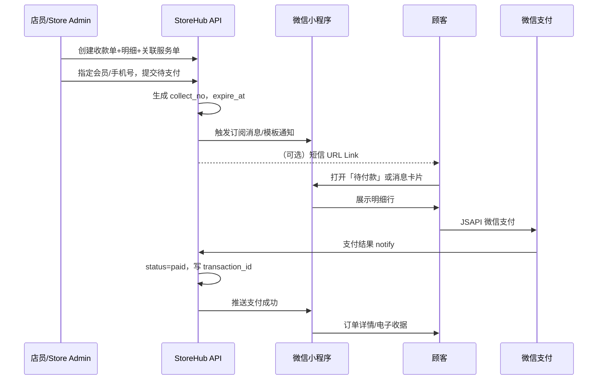

# 线下收款单与小程序触达支付

> 场景：店员/门店 **手动创建收款单**（如自行车打包服务 + 快递附加费），通过 **微信小程序** 推送给顾客，顾客在 **订单页微信支付**，替代微信私转账，全程可跟踪、可对账、可关联服务单。

---

## 1. 要解决什么问题

| 现状（私转账） | 目标（系统收款单） |
|----------------|-------------------|
| 金额、项目说不清 | 明细行：服务费、快递费、材料费等 |
| 财务难对账 | 支付流水与 `collect_no` 一一对应 |
| 与服务单脱节 | 可关联 `service_order`（打包业务） |
| 顾客被动 | 小程序推送 + 待付款列表，体验清晰 |
| 非顾客主动下单 | **店员创建**，顾客只负责确认支付 |

---

## 2. 在 StoreHub 中的位置

```
Store Admin / 店长端 / POS
        │
        ▼ 手动创建
┌───────────────────┐
│  store_collect    │  收款单（本模块核心）
│  _orders          │
└─────────┬─────────┘
          │ 关联（可选）
          ▼
┌───────────────────┐     ┌───────────────────┐
│  service_order    │     │  member           │
│  自行车打包等      │     │  会员/手机号       │
└───────────────────┘     └───────────────────┘
          │
          ▼ 推送触达
┌───────────────────┐
│  微信小程序         │  待付款 → 明细 → 微信支付
└───────────────────┘
          │
          ▼ 回调
┌───────────────────┐
│  微信支付商户平台    │  transaction_id 回写
└───────────────────┘
```

收款单 **仅属于 StoreHub**，不走 CommerceHub 平台订单，也不走电商 RMA。

---

## 3. 核心实体：收款单（Collect Order）

### 3.1 主表

```
store_collect_orders
  ├── collect_no              -- 收款单号 COL-20260615-001
  ├── store_id                -- 门店
  ├── member_id               -- 会员（可选，散客可仅手机号）
  ├── member_phone            -- 触达用
  ├── created_by              -- 店员 user_id
  ├── ref_service_order_id    -- 关联服务单（如自行车打包）
  ├── ref_service_type        -- pack_bike / repair / ...
  ├── title                   -- 展示标题「自行车打包及寄送」
  ├── status                  -- 见状态机
  ├── total_amount            -- 合计
  ├── paid_amount
  ├── wx_prepay_id            -- 预支付
  ├── wx_transaction_id       -- 支付成功流水号
  ├── paid_at
  ├── expire_at               -- 支付链接/订单有效期（如 24h）
  ├── remark                  -- 店员备注（顾客可见）
  └── notify_status           -- 推送状态
```

### 3.2 明细行（费用拆清楚）

```
store_collect_order_items
  ├── collect_order_id
  ├── line_type               -- service_fee | addon_express | addon_material | discount | custom
  ├── name                    -- 「自行车打包服务费」「顺丰快递费」
  ├── description             -- 可选说明
  ├── quantity
  ├── unit_price
  ├── amount                  -- 行小计
  ├── ref_sku_id              -- 可选，关联 ProductCore 服务类 SKU
  └── sort
```

**示例：自行车打包**

| line_type | name | amount |
|-----------|------|--------|
| service_fee | 自行车打包服务费 | ¥80 |
| addon_express | 顺丰快递费（乌鲁木齐） | ¥45 |
| addon_material | 纸箱+气泡膜 | ¥15 |
| **合计** | | **¥140** |

顾客在小程序看到的与店员创建时 **完全一致**，避免扯皮。

---

## 4. 状态机

```
draft（草稿，可选）
    → pending_payment（待顾客支付）← 创建并推送
          │
          ├─ paid（已支付）← 微信回调成功
          ├─ cancelled（店员取消）
          └─ expired（超时未付）

paid 后可触发：
  · 服务单状态 → 已收款/可施工
  · 订阅消息「支付成功」
  · 财务日报入账
```

---

## 5. 小程序触达与支付（推荐方案）

### 5.1 整体流程



### 5.2 用户身份：登录后如何「找到他」

顾客 **注册/登录小程序** 后，StoreHub 会绑定以下标识（存在 `member` / `member_channel_bindings`）：

| 标识 | 来源 | 用途 |
|------|------|------|
| **openid** | 小程序 `wx.login` | 小程序内支付、订阅消息投递对象 |
| **unionid** | 同一微信开放平台下多应用 | 关联 **服务号** 与小程序为同一人 |
| **手机号** | 用户点击授权「获取手机号」 | 店员搜人、短信触达、线下归并会员 |

**可以找到他的前提：**
- 曾在 **本小程序** 登录过 → 有 `openid`（+ 可选 `unionid`）
- 授权过手机号 → 店员可按手机号匹配并创建收款单
- 店员创建收款单时选择/绑定 `member_id` → 该单进入他的「待付款」

**注意：** 仅有手机号、从未打开过小程序的人，无法直接推订阅消息，需 **短信 URL Link** 或 **收款小程序码** 引导首次进入并登录。

### 5.3 推送方式：订阅消息 vs 服务号（能否推、怎么推）

| 方式 | 能否主动推 | 前提条件 | 典型场景 |
|------|------------|----------|----------|
| **小程序订阅消息** | 有限次/长期订阅（看模板） | 用户曾在小程序内 **点「允许订阅」** | 「您有一笔待支付 ¥140」→ 点进收款页 |
| **服务号模板消息** | 可主动发（在规则内） | 用户 **关注服务号** + 小程序与服务号 **同一开放平台 unionid 打通** | 服务进度、待付款提醒（补充触达） |
| **小程序待付款列表** | 不需推送 | 用户打开小程序 | 最稳，不依赖推送权限 |
| **短信 URL Link** | 可发 | 有手机号 | 未在小程序内或订阅未授权时 |

**结论：**
- 不是「只要登录就能无限推送」— 订阅消息需要用户 **授权订阅**；服务号需要 **关注 + unionid 关联**。
- 实践上 **三条腿走路**：① 待付款列表（必现） ② 订阅/服务号（提醒） ③ 短信/收款码（兜底）。
- 用户登录且绑定手机号后，**店员一定能找到账户并挂上单**；**触达**用上面组合，**付款**在小程序订单页完成。

### 5.4 触达方式（可组合，操作层）

| 方式 | 适用 | 说明 |
|------|------|------|
| **小程序订阅消息** | 已授权用户 | 「您有一笔待支付订单 ¥140」→ 点击进详情 |
| **小程序待付款列表** | 已绑定会员 | 顾客打开小程序即见，不依赖推送 |
| **URL Link / Short Link** | 短信、企微、微信聊天 | 未在小程序内时，点开直达收款页 `pages/collect/pay?id=xxx` |
| **服务号模板消息** | 有服务号且 openid 打通 | 补充触达 |
| **店员展示小程序码** | 到店当面 | 收款单专属小程序码，顾客扫码即付 |

**不推荐**：让顾客微信转账店员个人号 — 无法自动对账、无明细、无与服务单关联。

### 5.3 支付技术：微信 JSAPI（小程序内）

1. Store API 调用微信 **统一下单**（`trade_type=JSAPI`，`openid` 来自小程序登录）
2. 返回 `prepay_id` → 小程序 `wx.requestPayment`
3. 微信 **支付回调 notify** → StoreHub 验签 → 更新 `paid` + `wx_transaction_id`
4. 幂等：以 `collect_no` + `transaction_id` 防重复入账

**商户配置：** 小程序 `appid` 与微信支付 **商户号 mchid** 绑定；StoreHub 存 `store_id → sub_mchid`（多门店时可子商户/分账，后期再做）。

### 5.4 散客（非会员）怎么办

| 场景 | 做法 |
|------|------|
| 顾客曾用过小程序 | `member_id` + openid，直接推送 |
| 仅有手机号 | 短信发 **URL Link**，打开后引导授权手机号 → 临时绑定 → 支付 |
| 到店当面 | 展示 **收款单小程序码**，扫码进入即付（可静默/openid 获取后支付） |

---

## 6. 店员创建收款单（Store Admin / 店长端）

### 6.1 创建界面要点

- 选择 **门店**、**顾客**（搜会员/输手机号）
- 可选 **关联服务单**（进行中的自行车打包 → 自动带出默认服务费，可改）
- **添加费用行**：从常用模板选（打包费、快递费…）或自定义
- 实时 **合计预览**
- 按钮：**「发送给顾客支付」** → `pending_payment` + 推送
- 按钮：**「出示收款码」** → 生成该单小程序码（当面场景）

### 6.2 费用模板（提高效率）

```
store_collect_fee_templates
  ├── store_id / global
  ├── name              -- 「标准自行车打包费」
  ├── line_type
  ├── default_amount
  └── ref_sku_id        -- 可选同步 ProductCore 服务 SKU
```

店员点选模板快速加行，再改金额/加快递费。

---

## 7. 与服务单、商品库的关系

```
service_order（自行车打包，状态=待收款）
        │
        ▼ 店员创建
store_collect_order（明细：打包费+快递费）
        │
        ▼ 顾客小程序支付
status=paid → service_order 状态 → 进行中/待发货
        │
        ▼ 若涉及实体配件
ProductCore sku_id（纸箱、耗材）可出现在明细或出库（可选）
```

- **服务** 用 `service_order` 管进度
- **钱** 用 `store_collect_order` 管收款与对账
- **货**（若有）仍走 ProductCore `sku_id`

---

## 8. 其他收款方式（补充，仍进系统）

| 方式 | 跟踪性 | 说明 |
|------|--------|------|
| **小程序 JSAPI（主推）** | ★★★★★ | 本方案 |
| **顾客扫收款单小程序码** | ★★★★★ | 同上，当面 |
| **POS 扫顾客付款码（被扫）** | ★★★★ | 先创建收款单再扫，金额已锁定 |
| **静态个人收款码** | ★ | 不推荐 |
| **现金** | ★★★ | 店员标记「现金已收」，需权限与审计 |

原则：**先有单，再有款** — 即使现金/POS 被扫，也先落 `store_collect_order`，再改 `paid`，保证可追溯。

---

## 9. 小程序 C 端：两类订单 + 统一「我的订单」

小程序里建议 **两类订单并列**，UI 类似电商，但来源不同：

### 9.1 订单类型对比

| | **商品订单** | **收款/服务单** |
|--|-------------|----------------|
| 谁创建 | 顾客在小程序选购 | **店员**在 Store Admin 创建 |
| 典型场景 | 买配件、俱乐部商品 | 自行车打包、维修费+快递附加费 |
| 明细 | 商品 SKU、数量、单价 | **服务费 / 快递费 / 材料费** 分行 |
| 支付 | 下单后微信支付 | 待付款 → 打开明细 → **微信支付** |
| 关联 | ProductCore SKU | 可关联 `service_order` 服务进度 |

### 9.2 「我的订单」页面结构（建议）

```
我的订单
├── 待付款          ← 商品待付 + 收款单待付 合并或 Tab 区分
├── 待收货/待自提    ←  mainly 商品订单
├── 进行中          ← 服务单（打包中、维修中）
├── 已完成
└── 全部

收款单详情页 pages/collect/pay
  · 标题：自行车打包及寄送
  · 明细表：打包费 / 快递费 / 材料费
  · 合计 + [立即支付] 按钮
  · 关联服务进度入口（如有）
```

顾客体验：**和电商一样有订单、有明细、有支付按钮**，只是这类单不是自己「逛店下单」，而是 **店员创建后出现在待付款里**（再配合订阅/服务号提醒）。

### 9.3 页面清单

| 页面 | 功能 |
|------|------|
| `pages/shop/*` | 商品浏览、购物车、**商品订单**下单支付 |
| `pages/collect/pay` | **收款单**详情 + 支付（消息/链接直达） |
| `pages/order/list` | 待付款 / 进行中 / 已完成（**两类订单**） |
| `pages/order/detail` | 商品订单或收款单详情 |
| `pages/service/detail` | 服务进度（打包/维修） |

支付前展示 **完整明细**；支付后可选 **电子收据**（PDF/图片，后期）。

---

## 10. 财务与报表

- 按 **门店 / 店员 / 日期** 汇总收款单
- 与微信支付 **对账单** 按 `transaction_id` 核对
- `line_type` 维度统计：服务费 vs 快递附加 vs 材料（经营分析）
- 导出给财务（CSV），避免从微信聊天记转账

---

## 11. 分阶段实施

| 阶段 | 内容 |
|------|------|
| **S1** | 收款单表 + Store Admin 手动创建 + 明细行 |
| **S2** | 小程序待付款列表 + JSAPI 支付 + 回调 |
| **S3** | 订阅消息 / URL Link 推送 |
| **S4** | 关联 service_order + 费用模板 |
| **S5** | 收款单小程序码、POS 被扫、分账（如需要） |

可在 **StoreHub 会员+小程序浏览商品** 同一阶段启动 S1～S2，业务价值高、闭环短。

---

## 12. 设计原则

1. **店员创单、顾客付单** — 适合非顾客主动发起的线下服务
2. **明细行必填** — 服务费与附加费分开，顾客看得见
3. **支付必须挂 collect_no** — 拒绝无单转账
4. **触达优先小程序** — 订阅消息 + 待付款 + URL Link 覆盖到店/不到店
5. **与服务单解耦又关联** — 钱在收款单，活在服务单
6. **微信官方支付** — 合规、可对账、可回调自动化

---

## 13. 一句话总结

> **StoreHub 收款单：店员手动建单、明细写清服务费与附加费，关联服务单；小程序推送待付款，顾客 JSAPI 支付；流水回写系统，替代微信私转账。**

参见 [ONLINE_OFFLINE.md](./ONLINE_OFFLINE.md) 中 StoreHub 整体定位。
