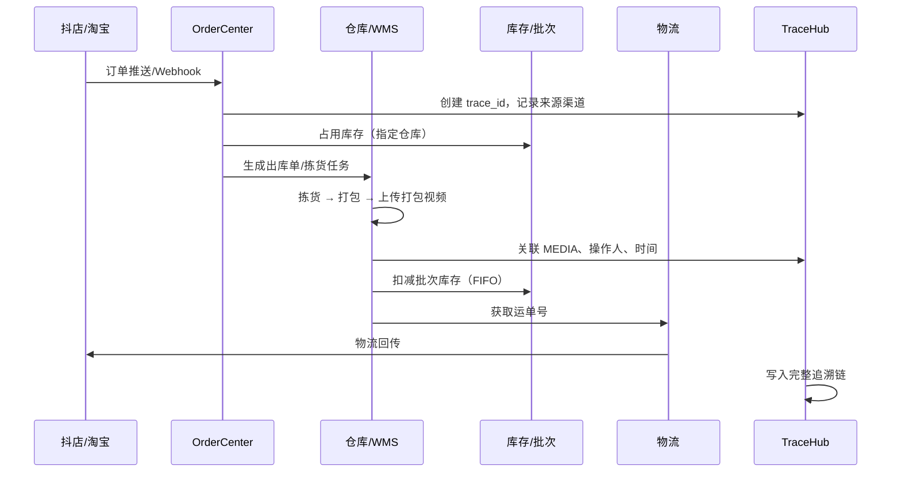
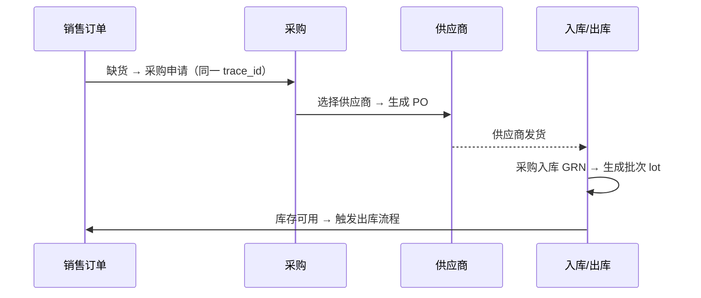

# 供应链与全链路追溯架构

> 在 ProductCore（商品库）与 OrderCenter（订单）之上，补齐 **供应商 → 采购 → 入库 → 库存 → 出库 → 打包发货 → 物流** 的完整链路，并支持每一张销售订单追溯到来源平台、采购单、供应商、打包视频等环节。**逆向售后**（退货签收、开箱视频、平台退款）见 [AFTER_SALES.md](./AFTER_SALES.md)。

---

## 1. 业务全景

卖出一件货，背后可能涉及：

```
电商/门店/维修 下单
    → 库存是否足够？
        ├─ 有货 → 出库 → 拣货 → 打包（录像）→ 快递
        └─ 缺货 → 采购申请 → 采购单 → 供应商发货 → 入库 → 再出库发货

全程需回答：
  · 这单货从哪个供应商来的？
  · 对应哪张采购单、哪次入库？
  · 从哪个仓库、哪个库位出的？
  · 谁打包的？有无打包视频？
  · 订单来自抖店还是门店？
```

**设计目标：一张订单 ID，拉出一条完整追溯链。**

---

## 2. 扩展后的领域架构

```
                         ┌──────────────────────────────────────┐
                         │         统一管理后台 (Vue)             │
                         │ 商品│订单│采购│入库│出库│仓库│供应商│追溯 │
                         └───────────────────┬──────────────────┘
                                             │
    ┌────────────┬────────────┬───────────────┼───────────────┬────────────┐
    ▼            ▼            ▼               ▼               ▼            ▼
ProductCore  OrderCenter   Procurement      WMS           Logistics   TraceHub
  商品/PIM      订单/OMS      采购/PMS        仓储           快递/轨迹    追溯中枢
    │            │            │               │               │            │
    │            │            └──── 供应商 VMS ─┘               │            │
    │            │                     │                        │            │
    └────────────┴──── SKU / 批次 / 库存流水 / 单据关联 ────────┴────────────┘
```

| 领域 | 英文缩写 | 核心职责 |
|------|----------|----------|
| **ProductCore** | PIM | 商品/SKU 主数据 |
| **Vendor Management** | VMS | 供应商档案、供货 SKU、价目、账期 |
| **Procurement** | PMS | 采购申请、采购单、到货、退货 |
| **Warehouse** | WMS | 仓库/库位、入库、出库、盘点、调拨 |
| **Inventory** | IMS | 可售库存、占用、批次库存、流水 |
| **OrderCenter** | OMS | 销售订单（电商/门店/服务） |
| **Fulfillment** | — | 拣货单、打包、发货、打包视频 |
| **Logistics** | TMS | 快递公司、运单、轨迹、平台回传 |
| **TraceHub** | — | 单据图谱、操作审计、媒体证据 |
| **AfterSale (RMA)** | — | 电商售后、退货签收、开箱视频、平台退款回传 |
| **Integration** | — | 各电商平台 API |

---

## 3. 核心概念：单据 + 批次 + 追溯链

### 3.1 三类单据

| 类型 | 单据 | 方向 | 说明 |
|------|------|------|------|
| **销售类** | 销售订单 SO | 需求 | 来自抖店/淘宝/门店/维修等 |
| **采购类** | 采购单 PO | 补货 | 向供应商采购 |
| **仓储类** | 入库单 GRN / 出库单 DO | 实物移动 | 采购到货、销售发货、调拨 |

所有单据共享：
- `doc_no` 统一编号规则
- `doc_type` 枚举
- `status` 状态机
- `trace_id` 业务追溯根 ID（见 3.3）
- `source_channel` / `source_ref` 来源引用

### 3.2 批次（Lot/Batch）— 追溯的关键

仅记录「SKU 库存数量」无法追溯到供应商。建议引入 **批次库存**：

```
inventory_lot
  ├── sku_id
  ├── lot_no          -- 批次号（入库时生成）
  ├── supplier_id     -- 供应商
  ├── po_id           -- 来源采购单
  ├── grn_id          -- 来源入库单
  ├── warehouse_id
  ├── qty_on_hand     -- 当前余量
  ├── cost_price      -- 批次成本
  └── received_at
```

**出库时指定扣减哪个批次**（FIFO 默认，可手动指定），从而建立：

```
销售订单行 → 出库单行 → 批次 lot → 入库单 → 采购单 → 供应商
```

### 3.3 追溯 ID（trace_id）

每一张 **销售订单** 创建时生成 `trace_id`（UUID 或 `TR{date}{seq}`），后续所有关联单据写入同一 trace_id：

```
trace_id: TR202606150001
  ├── SO-20260615-0088     销售订单（source: douyin, shop: xxx）
  ├── DO-20260615-0032     出库单
  ├── PK-20260615-0032     拣货/打包单
  ├── MEDIA-pack-xxx       打包视频
  ├── SHP-20260615-0018    运单（SF1234567890）
  ├── LOT-20260520-A12     扣减批次
  ├── GRN-20260518-0045    入库单
  ├── PO-20260510-0021     采购单
  └── SUP-华为配件商行      供应商
```

缺货触发的采购，采购单也挂同一 `trace_id`，入库后再走出库。

### 3.4 单据关联表（Trace Graph）

除 trace_id 外，建议显式记录有向关联，便于图谱查询：

```
document_links
  from_doc_type / from_doc_id
  to_doc_type   / to_doc_id
  link_type     -- fulfills | sourced_from | ships | evidences
```

示例：
- `SO → DO`（fulfills）
- `DO → SHP`（ships）
- `DO → MEDIA`（evidences，打包视频）
- `DO_item → LOT`（sourced_from）
- `LOT → GRN → PO → SUPPLIER`

---

## 4. 端到端流程

### 4.1 有库存 — 标准电商发货



### 4.2 缺货 — 采购补货再发



### 4.3 门店订单

- `source_channel = store`，附加 `store_id`、导购员
- 履约方式：
  - **门店自提**：出库仓 = 门店仓，无快递，可有交接照片/签字
  - **总部代发**：出库仓 = 中心仓，走标准快递流程

### 4.4 维修/服务订单

- 若涉及配件出库：走 WMS 出库，trace 关联服务工单
- 若无实物：仅记录服务过程照片/视频，不扣库存

---

## 5. 各子系统设计要点

### 5.1 供应商管理（VMS）

```
suppliers              -- 供应商主档
supplier_contacts      -- 联系人
supplier_skus          -- 供货清单（supplier_id + sku_id + 供货价 + 起订量 + 交期）
supplier_contracts     -- 合同/账期（可选，后期）
```

**与 ProductCore 关系：**
- 一个 SKU 可有 **多个供应商**（主供/备供）
- 采购时默认推荐主供，可改选

### 5.2 采购管理（PMS）

```
purchase_requisitions  -- 采购申请（可来自缺货、手工、安全库存预警）
purchase_orders        -- 采购单 PO
purchase_order_items   -- 采购行（sku_id, qty, price, expected_date）
purchase_receipts      -- 到货登记（可多次到货）
```

**状态机：**
```
草稿 → 待审核 → 已下单 → 部分到货 → 已完成 / 已关闭
                      ↘ 已取消
```

**与销售订单联动：**
- PO 可标记 `ref_so_id` / `trace_id`，表示「为哪张销售单采购」

### 5.3 仓库管理（WMS）

```
warehouses             -- 仓库（中心仓、门店仓、退货仓）
warehouse_locations    -- 库位（A-01-02，后期精细化）
inbound_orders         -- 入库单（采购入库、退货入库、调拨入库）
outbound_orders        -- 出库单（销售出库、调拨出库、报损）
stock_moves            -- 库存移动流水（不可删，只追加）
stock_takes            -- 盘点
transfers              -- 调拨单
```

**出库单与销售订单：**
- 一张 SO 可拆多张 DO（分批发货）
- 一张 DO 可含多个 SO（拼单发货，可选后期）

### 5.4 打包发货与视频存证

```
pick_pack_tasks        -- 拣货打包任务
  ├── picker_id        -- 拣货员
  ├── packer_id        -- 打包员
  ├── packed_at
  └── status

media_evidences        -- 媒体证据（通用）
  ├── ref_doc_type     -- outbound_order / service_order
  ├── ref_doc_id
  ├── media_type       -- pack_video / photo / sign
  ├── file_url         -- OSS
  ├── duration_sec
  └── uploaded_by
```

**建议流程：**
1. 出库单进入「待打包」→ 工作台扫描订单号/运单号
2. 开始打包时自动/手动开启录像（摄像头或手机 App 上传）
3. 视频 URL 写入 `media_evidences`，关联 `trace_id`
4. 售后纠纷时可按订单号一键调阅

### 5.5 物流（TMS）

```
shipments              -- 运单
  ├── carrier_code     -- SF/YTO/ZTO
  ├── tracking_no
  ├── outbound_id
  └── platform_sync_status  -- 各平台回传状态

logistics_traces       -- 轨迹节点
```

### 5.6 追溯中枢（TraceHub）

```
trace_records          -- trace_id 主表
trace_events           -- 时间线事件（谁在何时做了什么）
document_links         -- 单据有向图
```

**后台「订单追溯」页面：**
- 输入：订单号 / 运单号 / 采购单号 / 批次号
- 输出：时间线 + 关系图谱 + 视频/图片入口

```
2026-06-15 10:02  抖店推送订单 SO-xxx（买家：张*）
2026-06-15 10:03  占用库存 SKU-001 x1（中心仓，批次 LOT-A12）
2026-06-15 14:20  生成出库单 DO-xxx，拣货员：李四
2026-06-15 14:35  打包完成，视频已上传 [查看]
2026-06-15 14:40  顺丰 SF1234567890，已回传抖店
─────────────────────────────────────────
来源批次 LOT-A12
  └ 入库 GRN-xxx（2026-05-18）
      └ 采购 PO-xxx（供应商：深圳 XX 商行）
```

---

## 6. 销售订单的「来源」维度

在 OMS 订单上统一刻画来源，便于统计与追溯：

| 字段 | 示例 |
|------|------|
| order_type | retail / store / service |
| source_channel | douyin / taobao / xhs / channels / xianyu / wx_mall / store / phone |
| platform_shop_id | 抖店店铺 ID |
| platform_order_id | 平台原始单号 |
| store_id | 门店 ID（门店单） |
| service_order_id | 关联维修工单 |

**来源不影响 WMS 出库流程**，但写入 trace_events 并在报表中可筛选。

---

## 7. 库存模型（IMS + 批次）

```
sku_stock_summary      -- SKU 各仓库可售汇总（查询用）
inventory_lots         -- 批次余量（追溯用）
stock_reservations     -- 订单占用（SO 待发货）
stock_movements        -- 所有变动流水
```

**变动类型：**
`purchase_in` / `sale_out` / `transfer_in` / `transfer_out` / `adjust` / `return_in`

每条 movement 记录：
- `ref_doc_type` + `ref_doc_id`
- `lot_id`（如有）
- `trace_id`（如有）

---

## 8. 分阶段建设（修订版）

在原有商品库 → 订单路线基础上，**采购与仓库建议早于或并行于多渠道接入**：

| 阶段 | 内容 | 追溯能力 |
|------|------|----------|
| **P1 商品库** | ProductCore SKU/分类/品牌 | — |
| **P2 供应商+仓库基础** | VMS 供应商、WMS 仓库、SKU 库存（可先不启用批次） | 基础库存 |
| **P3 采购+入库** | PO、采购入库、**启用批次** | 货 → 供应商 |
| **P4 订单+出库** | OMS（先做 1~2 个渠道或手工录单）、出库、占用/扣减 | 单 → 出库 |
| **P5 打包视频+物流** | 打包台、视频上传、运单、平台回传 | 单 → 视频 → 物流 |
| **P6 追溯台** | TraceHub 时间线 + 单据图谱 UI | **全链路可查** |
| **P7 多渠道+门店+维修** | Integration 扩展 | 全渠道追溯 |

**为什么 P2/P3 要早：**
- 没有批次和采购，追溯「供应商从哪来」无从谈起
- 先跑通「采购入库 → 销售出库」内部闭环，再接电商订单更稳

---

## 9. Go 项目结构（修订）

```
biz-platform/                   # 建议最终 monorepo 名
├── cmd/
│   ├── product-api/
│   ├── order-api/
│   ├── wms-api/              # 仓储+采购+供应商
│   └── worker/               # 同步、预警、重试
├── internal/
│   ├── product/
│   ├── vendor/               # VMS
│   ├── procurement/          # PMS
│   ├── warehouse/            # WMS
│   ├── inventory/            # IMS + lot
│   ├── order/
│   ├── fulfillment/          # 拣货打包
│   ├── logistics/
│   ├── trace/                # TraceHub
│   └── integration/
├── web/
│   ├── views/product/
│   ├── views/order/
│   ├── views/procurement/    # 采购单
│   ├── views/warehouse/      # 入库/出库/盘点
│   ├── views/vendor/         # 供应商
│   └── views/trace/          # 追溯查询
└── docs/
```

---

## 10. 关键表清单（Phase 1 可预留）

**商品（P1 实现）：** products, skus, categories, brands, product_groups

**供应商（P2）：** suppliers, supplier_skus

**采购（P3）：** purchase_orders, purchase_order_items, purchase_receipts

**仓储（P2~P3）：** warehouses, inbound_orders, inbound_items, outbound_orders, outbound_items

**库存（P3）：** inventory_lots, stock_movements, stock_reservations

**订单（P4）：** orders, order_items, order_addresses

**履约（P5）：** pick_pack_tasks, shipments, media_evidences

**追溯（P4 起逐步）：** trace_records, trace_events, document_links

---

## 11. 设计原则小结

1. **批次是追溯的锚点** — 出库必须关联到批次，批次必须关联到入库与采购
2. **trace_id 贯穿始终** — 从销售单生成，采购/入库/出库/运单/视频全部挂载
3. **流水不可篡改** — stock_movements、trace_events 只追加不修改
4. **媒体证据一等公民** — 打包视频与出库单、trace_id 强绑定，存 OSS
5. **来源渠道标准化** — OMS 统一枚举，报表与追溯展示一致
6. **模块边界清晰** — VMS/PMS/WMS/OMS 各自状态机，通过事件和 document_links 协作

---

## 12. 与 ProductCore 的衔接

- **SKU 是全局 ID**：采购、入库、出库、订单行全部引用 `sku_id`
- **supplier_skus** 维护供货关系，ProductCore 不冗余供应商价（采购单快照价格）
- **可售库存** = WMS 批次汇总 − 订单占用；ProductCore 后台可只读展示
- **商品库 Phase 1** 建表时预留 `inventory_lots`、`trace_records` 外键字段即可，不必一次实现

**一句话：卖的是订单，动的是库存，买的是采购，存的是批次，查的是 trace_id。**
